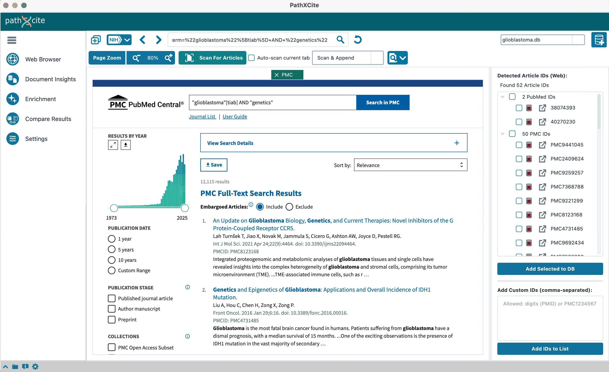

# pathXcite
## An Integrated Solution for Literature-Based Gene Enrichment
<!--
0E8088 dark teal
AA6005 dark orange
0F739E muted dark blue
666666 dark grey 
3D91A6 other lighter teal-->
<p align="left">
 
  <a href="https://sysbio.uni-ulm.de/software/pathxcite/html/index.html" target="https://sysbio.uni-ulm.de/software/pathxcite/html/index.html"></a>
  <a href="./LICENSE"></a>
  </img>
  </img>
  </img>
</p>

**pathXcite** is an integrated **graphical tool** for **literature-based over-representation analysis** (ORA). It tests a list of genes against curated libraries to find enriched pathways, phenotypes, diseases, and other biological concepts.

When experimental data is limited or analyses are exploratory, a literature-driven approach can reveal relevant **associations between your topic and over-represented functional terms**.

Streamlined and accessible — pathXcite covers the full workflow: literature curation, gene extraction & mapping, ranking, and interactive comparative enrichment — all in a self-contained environment with minimal setup.

Key benefits:
- **End-to-end GUI workflow** for reproducible analyses  
- Support for **curated libraries and custom .gmt files**  
- **Interactive**, exportable results and comprehensive documentation
- Usable for both quick exploration and in-depth studies

Links: 
- **Repository:** <https://github.com/sysbio-bioinf/pathXcite>  
- **Documentation & Tutorials:** [pathXcite Website](https://sysbio.uni-ulm.de/software/pathxcite/html/index.html)


---

## Table of Contents
- [Key Features](#key-features)
- [Quick Start](#quick-start)
- [Installation](#installation)
  - [Option A: Download ZIP](#option-a-download-zip)
  - [Option B: Clone with Git](#option-b-clone-with-git)
  - [Expected Files](#expected-files)
  - [Assumptions & Notation](#assumptions--notation)
- [OS-Specific Setup](#os-specific-setup)
  - [Windows 10+](#windows-10)
  - [macOS 14+](#macos-14)
  - [Ubuntu 20.04+](#ubuntu-2004)
- [Verify Installation](#verify-installation)
- [Recommended Configuration](#recommended-configuration)
  - [Entrez API Key (faster metadata)](#entrez-api-key-faster-metadata)
  - [Gene Set Libraries](#gene-set-libraries)
- [Workflow at a Glance](#workflow-at-a-glance)
- [Gene Ranking Strategies](#gene-ranking-strategies)
- [Inputs & Outputs](#inputs--outputs)
- [Supported Gene Set Libraries](#supported-gene-set-libraries)
- [System Requirements](#system-requirements)
- [Troubleshooting](#troubleshooting)
- [Links](#links)
- [Citation & License](#citation--license)
- [Contributing](#contributing)

---

## Key Features

- Retrieve literature (PubMed / PMC) and build a curated corpus  
- Extract gene mentions and map to official gene symbols (and **NCBI Gene IDs** via PubTator Central)  
- Rank genes by **Absolute Frequency** or **GF-IDF** (gene-frequency inverse document frequency)  
- Enrichment against **240+** built-in libraries or custom **`.gmt`** files  
- Interactive visualizations, exportable results, and local **self-contained project folders** for reproducibility

> Check out our [Quick start and step-by-step tutorials](https://sysbio.uni-ulm.de/software/html/index.html)
<p align="center">
  
</p>


---

## Quick Start

```bash
git clone https://github.com/sysbio-bioinf/pathXcite.git
cd pathXcite
# macOS / Linux
chmod +x ./setup.sh && ./setup.sh
# Windows (PowerShell)
powershell -ExecutionPolicy Bypass -File ".\setup_win.ps1"
````

Then follow the **5-step workflow**:

1. **Create project**
2. **Add articles**
3. **Extract & map genes**
4. **Rank genes**
5. **Run enrichment**
---

## Installation
*Note: On our website, you can find more infos and troubleshooting.*
### Option A: Download ZIP

1. Go to the repository: [https://github.com/sysbio-bioinf/pathXcite](https://github.com/sysbio-bioinf/pathXcite)
2. **Code → Download ZIP**
3. Unzip (folder name may be `pathXcite` or `pathXcite-main`)
4. Move the folder to a convenient location (e.g., `Documents/`)

### Option B: Clone with Git

```bash
git clone https://github.com/sysbio-bioinf/pathXcite.git
```

### Expected Files

After downloading/cloning you should have:

```
app/        main.py
setup.sh    setup_win.ps1
requirements.txt setup_gmt_files.py
test_imports.py pathXcite_win.bat
...
```

### Assumptions & Notation

* Examples use `~/Documents/pathXcite` (macOS/Linux) or `%HOMEPATH%\Documents\pathXcite` (Windows).
* If using the ZIP, your folder might be `pathXcite-main` — adjust paths accordingly.
* In code blocks, type everything **after** `$` (do not include the `$`).

---

## OS-Specific Setup

### Windows 10+

**Step 1 — Open PowerShell**

* Press **⊞ Win**, type **PowerShell** (or **Windows Terminal**), press **Enter**.
* Or **Win + X → Windows Terminal**.

**Step 2 — Go to the folder**

```powershell
cd "%HOMEPATH%\Documents\pathXcite"
```

*(Tip: In File Explorer, right-click the folder background → **Open in Terminal**.)*

**Step 3 — First-time setup**

* **Option 1:** Double-click `setup_win.ps1` in File Explorer. If SmartScreen appears: **More info → Run anyway**.
* **Option 2 (with logging):**

  ```powershell
  powershell -ExecutionPolicy Bypass -File ".\setup_win.ps1"
  ```
* If scripts are blocked for the session:

  ```powershell
  Set-ExecutionPolicy -Scope Process -ExecutionPolicy Bypass
  ```

**What this does:** creates a local environment using the bundled Python, installs required packages, and launches pathXcite.

**Step 4 — Subsequent launches**

```powershell
powershell -ExecutionPolicy Bypass -File ".\setup_win.ps1"
```

**Security prompts you might see**

* **SmartScreen:** *More info → Run anyway*.
* **“Running scripts is disabled”**: use the one-time bypass above (Process scope only).

---

### macOS 14+

**Step 1 — Open Terminal**

* **⌘ + Space** → type **Terminal** → **Return**, or **Applications → Utilities → Terminal**.

**Step 2 — Go to the folder**

```bash
cd "$HOME/Documents/pathXcite"
```

*(Tip: Drag the folder into the Terminal window to autofill the path.)*

**Step 3 — Make the installer executable (first time)**

```bash
chmod +x ./setup.sh
chmod +x ./pathXcite_os.sh
```

**Step 4 — Run the installer**

```bash
./setup.sh
```

**Step 5 — Subsequent launches**

```bash
./pathXcite_os.sh
```

**Security prompts you might see**

* **Gatekeeper**: if you see “can’t be opened,” go to **System Settings → Privacy & Security**, click **Open Anyway**, then run again.
* **Permission denied**: ensure you ran `chmod +x setup.sh`.

---

### Ubuntu 20.04+

**Step 1 — Open Terminal**

* **Ctrl + Alt + T**, or search **Terminal** in Activities.

**Step 2 — Go to the folder**

```bash
cd "$HOME/Documents/pathXcite"
```

**Step 3 — Make the installer executable (first time)**

```bash
chmod +x ./setup.sh
chmod +x ./pathXcite_os.sh
```

**Step 4 — Run the installer**

```bash
./setup.sh
```

**Step 5 — Subsequent launches**

```bash
./pathXcite_os.sh
```

**Common hints**

* **Permission denied**: ensure `chmod +x setup.sh` was run.
* **Missing unzip** (only if unzipping via terminal):

  ```bash
  sudo apt update && sudo apt install unzip
  ```

---

## Verify Installation

1. After setup completes, **pathXcite launches automatically**.
2. Keep the terminal open during the **first run**; a few packages may finish installing in the background.
3. If you moved the folder after installing, **re-run the installer** once in the new location.
4. If it doesn’t start, re-run the OS-specific command from the correct folder.

---

## Recommended Configuration

### Entrez API Key (faster metadata)

1. Create an API key in your **NCBI Account** settings.
2. In pathXcite, open **Settings → Account API**.
3. Paste the key and your email and save. Retrieval is typically **~3-4 times faster**.

### Gene Set Libraries

* In **Settings → Libraries**, download or update Enrichr libraries used for enrichment.
* To use **custom terms**, add your own **`.gmt`** files.

---

## Workflow at a Glance

1. **Create a project** — A folder stores corpus, annotations, and results (portable, reproducible).
2. **Add articles** — Supply **PMIDs/PMCIDs** or use the integrated browser; curate as needed.
3. **Extract genes** — Annotate gene mentions and map to **NCBI Gene IDs**.
4. **Rank genes** — Choose **Absolute Frequency** or **GF-IDF** (topic-specific weighting).
5. **Run enrichment** — Select libraries, inspect **interactive visualizations**, export results.

> See **Quick Start** and full walkthroughs with screenshots at [the Website](https://sysbio.uni-ulm.de/software/html/index.html).

---

## Gene Ranking Strategies

* **Absolute Frequency** — counts mentions; highlights widely studied genes.
* **GF-IDF** — emphasizes topic-specific genes by down-weighting globally common ones.
  **Tip:** Run enrichment with **both** lists to reveal complementary signals.

---

## Inputs & Outputs

**Inputs**

* PMIDs / PMCIDs (or integrated browser search results)
* Optional species filters
* Optional **custom libraries** via `.gmt`

**Outputs**

* Ranked gene lists (Absolute Frequency, GF-IDF) with **NCBI Gene IDs**
* Enrichment tables (**p-values**, **FDR**, **overlap**)
* Interactive plots; exportable **figures** and **tables**
* **Self-contained project folders** for reproducibility

---

## Enrichr Provides >240 Supported Gene Set Libraries

* **Gene Ontology** (BP/MF/CC), **HPO**
* **KEGG**, **Reactome**, **WikiPathways**, **BioCarta**, **BioPlanet**
* **TF/regulatory**: ChEA, ENCODE, JASPAR, TRRUST
* **Disease**: DisGeNET, OMIM, ClinVar, Orphanet, MGI
* **Drug signatures**: LINCS L1000, DSigDB, GEO perturbations
* **Cell/tissue**: GTEx, ARCHS4, CellMarker, Azimuth, Allen Brain Atlas
* **Complexes & PPIs**: CORUM, BioPlex, virus–host interaction sets
* **Custom**: import your own **`.gmt`** files

---

## System Requirements

* **Windows 10+**, **macOS 14+** (Intel/Apple Silicon), or **Ubuntu 20.04+**
* **≥ 4 GB RAM** (8 GB recommended)
* **~4 GB** disk (tool + databases)
* Internet required for literature retrieval and library downloads (after article retrieval and caching, **offline** use is possible)

---

## Troubleshooting

* **“Permission denied” (macOS/Linux)**

  ```bash
  chmod +x setup.sh
  ```
* **“Running scripts is disabled” (Windows)** — one-time bypass (Process scope only)

  ```powershell
  Set-ExecutionPolicy -Scope Process -ExecutionPolicy Bypass
  ```
* **SmartScreen / Gatekeeper** — choose **More info → Run anyway** (Windows) or **Open Anyway** in **Privacy & Security** (macOS).
* **Slow first run** — set your **Entrez API key** (Settings → Entrez) and ensure network connectivity.
* **Folder name mismatch** (after ZIP) — your folder may be `pathXcite-main`; update your `cd` path.

---

## Links
* **Project repo:** [https://github.com/sysbio-bioinf/pathXcite](https://github.com/sysbio-bioinf/pathXcite)
* **Documentation, Quick Start, Tutorials:** [https://sysbio.uni-ulm.de/software/pathxcite/html/index.html](https://sysbio.uni-ulm.de/software/pathxcite/html/index.html)

---

## Citation & License

If you use **pathXcite** in your research, please cite:

> **[../DOI or CITATION.cff]**

Licensed under the **MIT License**. See [`LICENSE`](./LICENSE).
Citation details in [`CITATION`](./CITATION) (or `CITATION.cff`).

---
